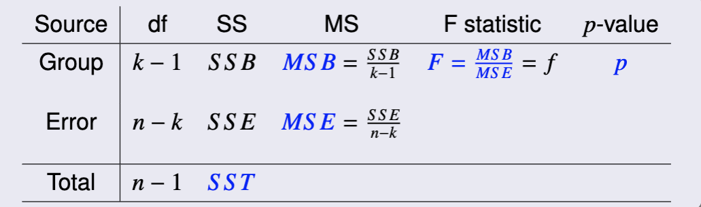

# Intermediate Statistics CA RStudio Notes

> **Welcome to MA 331 Spring 2023!**

> These notes are meant to help you succeed in this course. These will include necessary tips for _R_ formulas you will need throughout this course. Feel free to give feedback on these via our emails: akassymo@stevens.edu, aleather@stevens.edu.

> **These notes are not meant to replace the slides.** For more info, please refer to the slides.

**I highly suggest installing _R Markdown_!** It will make your life so much easier. [Here's a great guide how to install _R Markdown_.](https://alexd106.github.io/intro2R/install_rmarkdown.html)

## Lecture 1

R formulas are **very** similar to Python. If you ever used _pandas_ or _scipy_, you will easily get into _RStudio_.

To separate code blocks from text in RMarkdown, you need to type:

    ```{r}

    *code here*

    ```

You have to close the code block if you want to have normal text after.

#### Some useful R formulas

create a variable: `x = ...`

> **Tip**: if you want to see what is stored in your variable, just type its name.

create a vector: `vector1 = c(x1, ..., xn)`

length of a vector: `length(v1)`

create a table / vector of vectors: `table1 = cbind(v1, ..., vn)`

> **Tip**: if you want to see what is stored in your vector, just type its name.

five-number summary: `summary(x)`

mean of a sample: `mean(x)`

median of a sample: `median(x)`

standard deviation of a sample: `sd(x)`

variance of a sample: `var(x)`

correlation coefficient between two samples: `cor(x,y)`

> **Tip**: a good practice would be to store these statistics in a separate variables. Let's say you test effectiveness of some product and store the data in a vector `data`. Use one-liners like `dataMean = mean(x)` or `dataSD = sd(x)` in the beginning of each Markdown file so you could always access those.

scatterplot: `plot(x)`

boxplot, histogram, pie-chart: `boxplot(x), hist(x), pie(x)`

### Normal Distribution

cdf of a normal distribution:
`pnorm(x, mean, sd)`

quantile of a normal distribution: `qnorm(q, mean, sd)`

normal QQ plot: `qqnorm(x)`

detrended QQ plot: `qqline(x)`

> **Tip**: you can always see the history of your console in the upper right corner, so if you ever need to remember a command you used last time you opened _RStudio_, you can always see it there.

## Lecture 2

In _R Markdown_ you can easily format math formulas! To do that, you just have to use \$ signs from both sides of an equation. There are a couple more cool things you could do inside the math equation:

1. Use an underscore \_{\<index\>} to add an index to your equation: `$H_{0}$` would give you $H_{0}$.
2. Use the tag \\overline{\<equation\>} to add a bar to your equation: `$\overline{X}$` would give you $\overline{X}$. **Don't forget the figure parentheses**.
3. You can directly type the greek letters in the formula using a backslash: `$\sigma$` would give you $\sigma$. If you need the capitalized letter $\Sigma$, just change it to `$\Sigma$`.
4. To do fractions, type \\frac{numerator}{denominanor}, so `$\frac{1}{n}$` would give you $\frac{1}{n}$.

> **Tip**: Use copy-paste. At first, this might seem tedious, but it's really easy when you get the grasp of it.

A very cool thing _R_ can do is to generate a random sample of trials.

To generate a random sample on a **normal** distribution:
`rnorm(sample size, mean, sd)`

### Binomial Distribution

cdf of a binomial distribution: `pbinom(x, number of trials, probability of a successful trial)`

quantile of a binomial distribution: `qbinom(q, number of trials, probability of a successful trial)`

pmf of a binomial distribution: `dbinom(x, number of trials, probability of a successful trial)`

> Be aware that pmf is not pdf! pmf (probability mass function) is used to describe discrete probability distributions while pdf (probability density functions) is used to describe continuous probability distributions.

To generate a random sample on a binomial distribution:
`rbinom(number of observations, number of trials, probability of a successful trial)`

> **Tip**: At this point, you probably have noticed that both normal and binomial distributions have similar _R_ function calls. For example, cdf always starts with a `p..` and quantile always starts with `q..`. This pattern will repeat in the future!

### Chi-square distribution

Chi-square distribution is a sum of squares of random variables. With chi-square distribution, you are introduced to a new parameter - degrees of freedom $df$.

In the case of chi-square distribution, $df = \mu$.

cdf of a chi-square distribution:
`pchisq(x, df)`

quantile of a chi-square distribution: `qchisq(q, df)`

### Student $\tau$-distribution

T-distribution is a ratio between a normal and a chi-square distribution.

In the case of t-distribution, $df = n - 1$, $\mu = 0$ and $var = \frac{n}{n-2}$ for $n>2$.

cdf of a t-distribution:
`pt(x, df)`

quantile of a t-distribution: `qt(q, df)`

### F-distribution

F-distribution is a ratio between to chi-square distributions. Because of that, it has two $df$ parameters.

In the case of F-distribution, $\mu = \frac{df_2}{df_2 - 2}$ for $m>2$.

cdf of an F-distribution:
`pf(x, df1, df2)`

quantile of an F-distribution: `qf(q, df1, df2)`

Note: $df_1$ refers to the degrees of freedom of the chi-square distribution in the numerator and $df_2$ refers to the degrees of freedom in the denominator.

> At this point, you might be really overwhelmed with the amount of theory. **I understand how you might feel**, but later all of these will start making sense. Each one of these distributions has a use, and you will be introduced to them shortly.

## Lecture 3

Confidence levels **are usually 95%**, if not stated otherwise.

### Confidence interval with a known $\sigma$

###

To find a confidence interval of a population mean with a **known** standard deviation (z-interval), there is a very easy procedure:

1. Let's say, you're given a vector `data`, standard deviation `sd` and confidence level `cf`.
2. Find the sample size of your dataset: `n = length(data)`.
3. Given confidence level `cf`, your quantile alpha is `alpha = 1 - cf`.
4. Then your z-interval is in between bounds 1 and 2, where: `bound1, bound2 = mean(data) ± qnorm(alpha / 2) * sd / sqrt(n)`.
5. `zinterval = c(bound1, bound2)`.

### Confidence interval with an unknown $\sigma$

###

If you don't known standard deviation of your population, you can use sample variance as an **estimate** of your population variance. This is the main trick to get t-interval:

1. You're given a dataset `data` and confidence level `cf`.
2. Find the sample size of your dataset: `n = length(data)`.
3. Given confidence level `cf`, your quantile alpha is `alpha = 1 - cf`.
4. Find the sample standard deviation and sample mean: `sampleSD = sd(data)`.
5. Then your t-interval is in between bounds 1 and 2, where: `bound1, bound2 = mean(data) ∓ qt(alpha / 2, n - 1) * sampleSD / sqrt(n)`.
6. `tinterval = c(bound1, bound2)`.

> **Tip**: you can reassign a new value to a variable like `bound1`, _R Markdown_ follows the order of commands in which they're typed in.

### Confidence interval irrespective of $\mu$

###

In the case, where we don't have both population mean and variance and we would like to find a confidence interval for the population variance, we can find chi-interval. We are using sample variance as an **estimate** for our population variance.

1. You're given a dataset `data` and confidence level `cf`.
2. Find the sample size of your dataset: `n = length(data)`.
3. Given confidence level `cf`, your quantile alpha is `alpha = 1 - cf`.
4. Find the sample variance: `samplevar = var(data)`.
5. Then your chi-interval is in between bounds 1 and 2, where: `bound1 = (n - 1) * samplevar / qchisq(1 - alpha / 2, n - 1)` & `bound2 = (n - 1) * samplevar / qchisq(alpha / 2, n - 1)`.
6. `chinterval = c(bound1, bound2)`.

### Population proportion interval

Given a dataset `data` we could convert it to binary with: `bdata = ifelse(data > ref, 1, 0)`, where `ref` is a reference point. Example: given a dataset `grades = [98, 56, 76, 47, 86]`:

```
passorfail = ifelse(grades > 70, 1, 0)
passorfail
```

```
[1] 1, 0, 1, 0, 1
```

To create a population proportion interval, given the binary dataset`bdata`:

1. Find the sample size of your dataset: `n = length(bdata)`.
2. Given confidence level `cf`, your quantile alpha is `alpha = 1 - cf`.
3. Find the sample proportion: `phat = mean(bdata)`.
4. Then your prop-interval is in between bounds 1 and 2, where: `bound1, bound2 = phat ∓ qnorm(alpha / 2) * sqrt(phat * (1 - phat)) / sqrt(n)`.
5. `propinterval = c(bound1, bound2)`.

## Lecture 4

$H_0$ is the null hypothesis and proposes that any difference between groups is due to statistical chance.

$H_a$ is the alternative hypothesis and contradicts the null hypothesis.

**The null and alternative hypotheses must always be stated before a hypothesis test.**

The goal of a hypothesis test to either reject or fail to reject the null hypothesis given a sample of the population. To come to a conclusion about the null hypothesis, we must compare the _p-value_ $p$ of the sample with the significance level $\alpha$ of the test.

The _p value_ of a sample is the probability that you obtain a sample that is at least as extreme as the one obtained.

When $p < \alpha$, we **reject** the null hypothesis in favor of the alternative hypothesis.

When $p > \alpha$, we **fail to reject** the null hypothesis.

The alternative hypothesis can either be **two-tailed** $\mu \neq \mu_0$, **left-tailed** $\mu < \mu_0$, or **right-tailed** $\mu > \mu_0$.

### Hypothesis test of a population mean with known $\sigma$

When we wish to conduct a hypothesis test of a population mean when population standard deviation is known, we will use a z-test.

1. First, we must identify the assumed mean of the population `mu`, mean on the sample `xbar`, sample size `n`, and population standard deviation `sd`.
2. Now we calculate the z-score of the sample using the formula `z = sqrt(n) * (xbar - mu) / sd`.
3. Then we calculate the p-value of the sample based on the z-score.

    a. for two-sided tests, we can use `p = 2 * pnorm(- abs(z))`.

    b. for left-tailed tests, we can use `p = pnorm(z)`.

    c. for right-tailed tests, we can use `p = 1 - pnorm(z)`.

4. Lastly, compare $p$ to $\alpha$ and write a proper conclusion.

### Hypothesis test of a population mean with unknown $\sigma$

When we wish to conduct a hypothesis test of a population mean, but we do not know the population standard deviation, we must use a one sample t-test.

1. We first must have our sample `x`, the side of the test (two-sided, right-tailed, or left-tailed) `side`, the assumed population mean `mu0`, and the confidence level of the test `1 - alpha`
2. To conduct a one sample t test in we can use the function `t.test(x, alternative = c("side"), mu = mu0, conf.level = 1 - alpha)`

    a. For the side of the test `side`, use `"two.sided"` for two-sided tests, `"less"` for left-tailed tests, and `"greater"` for right-tailed tests.

    b. If you do not enter a confidence level for the t-test, R will default to a confidence level of 95%.

3. R will automatically compute the p-value for you, so now you just compare $p$ with $\alpha$ and write a proper conclusion.

### Hypothesis test of the difference of two population means

When we want to test for a difference of two population means within the same test subjects, we can conduct a two sample paired t-test.

> The difference between a paired t-test and unpaired t-test is that a paired t-test involves the same test subjects while the test subjects in an unpaired t-test are unrelated.

1. We first need our two samples `x` and `y`, the side of the test `side`, and the confidence level of the test `1 - alpha`
2. We can use the R function `t.test(x, y, alternative = c("side"), paired = TRUE, conf.level = 1 - alpha)`

    a. We do not need to enter a mean for the difference between the population means, since under the null hypothesis, we assume there is no difference between the means $H_0: \mu_x - \mu_y = 0$.

    b. For the side of the test `side`, use `"two.sided"` for two-sided tests, `"less"` for left-tailed tests, and `"greater"` for right-tailed tests.

    c. If you do not enter a confidence level for the t-test, R will default to a confidence level of 95%.

3. R will calculate the p-value, so now you compare $p$ with $\alpha$ and write a proper conclusion.

### Hypothesis test of a population proportion

When conducting a hypothesis about a population of a proportion, we use a z-test.

1. We first need a binary sample `x` where "1" indicates a success and "0" indicates a failue (refer to Population proportion intervals in Lecture 3 on how to convert a data set to binary)
2. We must also know the assumed population proportion `p0`, the side of the test `side`, and the confidence level `1 - alpha`
3. To run the test in R, we can use the funciton `prop.test = (sum(x), length(x), p = p0, alternative = c("side"), conf.level = 1 - alpha)`

    a. For the side of the test `side`, use `"two.sided"` for two-sided tests, `"less"` for left-tailed tests, and `"greater"` for right-tailed tests.

    b. If you do not enter a confidence level for the t-test, R will default to a confidence level of 95%.

# Importing and working datasets in RStudio

In the upcoming assignments, you'll have to import datasets in _RStudio_. Instead of typing data ina vector manually, you could import it with a built-in import. ~~Trust me, you'll need it when you have huge datasets.~~

Usually, you'll work with Excel files. To import a dataset:

1. Download the Excel dataset from Canvas;
2. Click on _File_ -> _Import Dataset_ -> _From Excel_;
3. Click _Browse..._ and find the dataset in your system.
4. From here you can either import it to your console or Markdown code block.

When working with datasets, you will have them imported as tables. To access a column in that table, use the `$` operator. For example, if you have dataset `dataSet` and you need a column called `groupA`, you would do something like this:

`data = dataSet$groupA`

> **Tip**: Try to save your dataset columns into new vectors in the beginning, instead of typing them out every time.

## Lecture 5

> **Tip**: If allowed, I recommend using R's built-in functions for the hypothesis tests. There are less steps, so there is a smaller chance of making mistakes.

### Hypothesis test of a difference between two means with known $\sigma$

When we wish to test for a difference between two population means when both population standard deviations are known, we can use a two sample z-test.

1. We first need the means of each sample `mean1` and `mean2`, population variances `var1` and `var2`, and the sample sizes of each group `n1` and `n2`.
2. We then calculate the z-score of the difference in population means `z=(mean1-mean2)/sqrt(var1/n1+var2/n2)`
3. We then calculate the p-value based on the side of the test.

    a. for two-sided tests where $H_a: \mu_1 \neq \mu_2$, we use `p = 2 * pnorm(-abs(z), 0, 1)`

    b. for left-tailed tests where $H_a: \mu_1 < \mu_2$, we ue `p = pnorm(z, 0, 1)`

    c. for right-tailed tests where $H_a: \mu_1 > \mu_2$, we use `p = 1 - pnorm(z, 0, 1)`

4. We then compare our p-value $p$ with our significance level $\alpha$ and write a proper conclusion.

### Hypothesis test of a difference between two means with unknown $\sigma$ and assumed equal variances

When we wish to test for a difference between two population means when we don't know population standard deviations, we can use a two sample t-test. In this case, we are assuming that the variances of both populations are equal. There are 2 ways we can solve this using R:

#### Calculating p-value step-by-step:

1. Identify the mean of both samples `mean1` and `mean2`, the pooled sample variance `var`, and the sample size of each group `n1` and `n2`.

    a. The formula for pooled sample variance can be found on the lecture slides for Week 5.

2. Calculate t-score: `t = (mean1 - mean2) / sqrt(var * (1 / n1 + 1 / n2))`
3. Calculate p-value:

    a. for two-sided tests where $H_a: \mu_1 \neq \mu_2$, we use `p = 2 * pt(-abs(t), n1 + n2 - 2)`

    b. for left-tailed tests where $H_a: \mu_1 < \mu_2$, we ue `p = pt(t, n1 + n2 - 2)`

    c. for right-tailed tests where $H_a: \mu_1 > \mu_2$, we use `p = 1 - pnorm(t, n1 + n2 - 2)`

4. Compare $p$ with $\alpha$ and write a proper conclusion.

#### Through R function t.test():

1. Identify your two samples `x` and `y`, the side of the test `side`, and the confidence level of the test `1-alpha`
2. We can now calcualte the p-value using the following R function: `t.test(x, y, alternative=c("side"), paired=FALSE, var.equal=TRUE, conf.level=1-alpha)`

    a. For the side of the test `side`, use `"two.sided"` for two-sided tests, `"less"` for left-tailed tests, and `"greater"` for right-tailed tests.

    b. If you do not enter a confidence level for the t-test, R will default to a confidence level of 95%.

3. Compare $p$ with $\alpha$ and write a proper conclusion.

### Hypothesis test of a difference between two means with no knowledge of $\sigma$

When we wish to test for a difference between two population means when we don't know population standard deviations, we can use a two sample t-test. There are 2 ways we can solve this using R:

#### Calculating p-value step-by-step:

1. Identify the mean of both samples `mean1` and `mean2`, the variance of each group `var1` and `var2`, and the sample size of each group `n1` and `n2`.
2. Calculate t-score: `t = (mean1-mean2)/sqrt(var1/n1+var2/n2)`
3. Calculate degrees of freedom `df = abs((var1/n1+var2/n2)^2/((var1/n1)^2/(n1-1)+(var2/n2)^2/(n2-1)))`
4. Calculate p-value:

    a. for two-sided tests where $H_a: \mu_1 \neq \mu_2$, we use `p = 2 * pt(-abs(t), df)`

    b. for left-tailed tests where $H_a: \mu_1 < \mu_2$, we ue `p = pt(t, df)`

    c. for right-tailed tests where $H_a: \mu_1 > \mu_2$, we use `p = 1 - pt(t, df)`

5. Compare $p$ with $\alpha$ and write a proper conclusion.

#### Through R function t.test:

1. Identify your two samples `x` and `y`, the side of the test `side`, and the confidence level of the test `1-alpha`
2. We can now calcualte the p-value using the following R function: `t.test(x, y, alternative=c("side"), paired=FALSE, var.equal=FALSE, conf.level=1-alpha)`

    a. For the side of the test `side`, use `"two.sided"` for two-sided tests, `"less"` for left-tailed tests, and `"greater"` for right-tailed tests.

    b. If you do not enter a confidence level for the t-test, R will default to a confidence level of 95%.

3. Compare $p$ with $\alpha$ and write a proper conclusion.

### Hypothesis testing on the equivalence on population variances

When we wish to test if the variances between two populations are equal, we can use an $F$-test

#### Calculating p-value step-by-step:
**I do not recommend doing it this way.  The R function will generally lead to less mistakes.**
1. Identify your two sample variances `var1` and `var2`, and the size of each sample `n1` and `n2`.
2. Calculate $f$ `f = var1 / var2`
3. Calculate p-value:

    a. a. for two-sided tests where $H_a: \sigma^2_1 \neq \sigma^2_2$, use `p = 2 * pf(f, n1 - 1, n2 - 1)` **Please note that this will only work when $S^2_1 \leq S^2_2$ When $S^2_1 > S^2_2$, we instead use:** `p = 2 * (1 - pf(f, n1 - 1, n2 - 1))`

    b. for left-tailed tests where $H_a: \sigma^2_1 < \sigma^2_2$, use `p = pf(f, n1 - 1, n2 - 1)`

    c. for right-tailed tests where $H_a: \sigma^2_1 > \sigma^2_2$, `p = 1 - pf(f, n1 - 1, n2 - 1)`

4. Compare $p$ and $\alpha$ and write a proper conclusion

#### Through R function var.test:

1. Identify your two samples `x` and `y`, the side of the test `side`, and the confidence level `1 - alpha`
2. Calculate p-value with the following function: `var.test(x, y, ratio = 1, alternative = c("side"), conf.level = 1 - alpha)`

    a. For the side of the test `side`, use `"two.sided"` for two-sided tests, `"less"` for left-tailed tests, and `"greater"` for right-tailed tests.

    b. If you do not enter a confidence level for the t-test, R will default to a confidence level of 95%.

3. Compare $p$ and $\alpha$ and write a proper conclusion.

### Comparing population proprotions through confidence intervals

1. Identify the two sample population proportions `phat1` and `phat2`, the sample size of each group `n1` and `n2`, and the confidence level `1 - alpha`
2. Estimate the standard deviation using the formula `sd = sqrt(phat1(1 - phat1) / n1 + phat2 (1 - phat2) / n2)`
3. Calculate the z-score at $1 - alpha / 2$ using: `z = qnorm(1 - alpha / 2, 0, 1)`
4. Create the confidence interval by doing the following:

`lower = phat1 - phat2 - z * sd`

`upper = phat1 - phat2 + z * sd`

`CI = c(lower, upper)`

### Hypothesis test of a difference between two population proportions

When conducting a test between two population proportions, we perform a z-test.

1. Identify both sample proportions `phat1` and `phat2` and the sample size of each group `n1` and `n2`.
2. Calculate the z-score with the function: `z = (phat1 - phat2) / sqrt(phat1(1 - phat1) / n1 + phat2(1 - phat2) / n2)`
3. Calculate p-value:

    a. for two-sided tests where $H_a: \hat{p}_1 \neq \hat{p}_2$, we use `p = 2 * pnorm(-abs(z), 0, 1)`

    b. for left-tailed tests where $H_a: \hat{p}_1 < \hat{p}_2$, we ue `p = pnorm(z, 0, 1)`

    c. for right-tailed tests where $H_a: \hat{p}_1 > \hat{p}_2$, we use `p = 1 - pnorm(z, 0, 1)`

4. Compare $p$ and $\alpha$ and write a proper conclusion.

## Lecture 6

### Creating a table

Before creating the table, it may be better to write it out on paper so you can better visualize how it should look.

1. We first create the rows of the table using `row1 = c()`.
2. We combine the rows into a table using `table = data.frame(row1, row2, row3)`

### Two-way table analysis

We can use a chi-squared test to test for association between the variables in the table.  
  
We use the function `chisq.test(table, correct=FALSE)` for a data set `table` and we do not use Yate's correction.  Yate's correction is used when one of the entires in the data set is less than 5.  You shouldn't need to use this correction in this course.

## Lecture 7

### ANOVA

ANOVA (Analysis of Variances) is a very useful technique when it comes to analyzing data-sets separated by a categorical variable. Like for example, boys and girls, adults and children, etc. 

> Usually, ANOVA is used to test the equivalence of population means of your groups. Be careful, because different hypothesis ca apply to different groups, cause each group's $p$-value can be different.

There is a one-way ANOVA test and a regular ANOVA. The first one means that we're testing only one independent variable. In general, one-way ANOVA test is just an $F$-test, where 
$df_1 = k - 1$ and
$df_2 = n - k$.
Regular full ANOVA uses the same method on every group. 

Next, it's important to establish **the ANOVA Table:**



Let's discuss every element in this table one by one:

* $SST$ (Sum of Squares Total) is a sum of squares of differences between all elements in the sample and its mean. 
* $SSE$/$SSW$ (Sum of Squares of Errors) is sum a of squares of differences between all elements in the sample and its group mean.
* $SSB$ (Sum of Squares Between) is a sum of squares of the differeces between the sample mean and respective group means for every element in the sample.

> $SST = SSB + SSE$

* $MSB$ (Mean Sum Between) is a average SSB for the respective group. 

> $MSB = \frac{SSB}{k - 1}$

* $MSE$ (Mean Sum of Errors) is a average SSE for the respective group. 

> $MSE = \frac{SSE}{n - k}$

* $f$-statistic is the same one from an $F$-test.
* $p$-value from the $F$-test:

$p = P_{H_{0}}(F > f) = 1 - pf(f, k - 1, n - k)$

### Coefficient of Determination

Coefficient of Determination is another metric used in ANOVA. A larger coefficient means larger confidence of significant difference between the means.

$R^2 = \frac{SSB}{SST}$

### Doing One-way ANOVA 

Luckily, there exist very useful *R* commands to do ANOVA for us. This is what we would do for a one way test, given a dataset `data`, where the numerical response is `response` and categorical variable is `factor`:

1. `tapply(response, factor, length)` to get the sizes of each category in the dataset.
2. `tapply(response, factor, mean)` to get the sample means of each category in the dataset.
3. `tapply(response, factor, var)` to get the sample variances of each category in the dataset.

> Tip: `tapply(..)` is a very useful function you can apply on a whole dataset, it's very similar to `map`.

4. `oneway.test(response ~ factor)` 

> Sometimes you have to specify `data` as a second argument.

But when we do real ANOVA, we have multiple groups to compare to each other. How do we know which groups in the dataset we group together? This is where **contrast** comes into play.

### Contrast

Think of contrast $\psi$ (read as *psi*) as of coefficient of pattern. To establish contrast between groups, we use these two equations:

$\psi = a_1\mu_1 + ... + a_k\mu_k$, , where $a_i$ are coefficients such that $a_1+ ... + a_k = 0$.

If $\psi = 0$, there's no difference between the groups.

Using this formula, we can estimate contrast using sample means, assuming groups are indepedent:

$\psi = a_1\overline{X}_1 + ... + a_k\overline{X}_k$

Similarly, pooled sample variance $S^2_p$ can be estimated through $MSE$. To test our estimations, we can use a $\Tau$-test and $F$-test. 

> I'm not going to go into an example of contrast inference, because it's a regular $\Tau$-test. For a good example, refer to Slides 7.

### Doing full ANOVA

Now that we know contrasts, we can subdivide the groups how we want in our dataset. Given a dataset `data`, where the numerical response is `response` and categorical variable is `factor` (assuming there are 6 categories, indexed from 0):

1. `tapply(response, factor, length)` to get the sizes of each category in the dataset.
2. Create a vector of patterns we want to test: `pattern = cbind(c(1, 1, -1, -1, -1, 1), 
c(0, 0, -1, 2, -1, 0))`. In this case, let's assume for the first pattern, groups 2, 3 and 4 are different from groups 0, 1 and 5. For the second pattern, we separate groups 0, 1, 5 and groups 2, 4 from the biggest outlier group 3. 

> Notice how all patterns result in sum of 0.

3. `contrasts(data$factor) <- pattern`.
4. Store the result of ANOVA: `result = aov(response ~ factor, data)` 
5. Summarize the result by contrasts: `summary.aov(result, split = list(factor=list("Pattern1" = 1, "Pattern2" = 2)))`

> TODO: Show a result example.

### LSD-test

> TODO


## Lecture 8

### Simple Linear Regression

Linear Regression is used to to show a linear association between an independent variable $X$ and a dependent variable $Y$.  The linear regression involves finding the least-squares regression line.  This line minimizes the sum of the residuals squared.  Please refer to the lecture slides for the proof.

**Before you test for a linear association, make sure to state your null and alternative hypothesis before the test, and write a proper conclusion afterwards.**

To make a linear regression model using R, we first must indentify our data set `data`, independent variable `x`, and independent variable `y`.  We can then write the following code:

`model = lm(y ~ x, data)`

`summary(model)`

### Residual Plots

Residual plots can be used to see how strong our linear regression model is.  To create the plot in R, we can write:

`plot(x, resid(model))`

`abline(h=0)`

>You can also add labels to the plot within the function `plot()` by using `xlab=`, `ylab=`, `main=`, etc.  You can also edit the line within the function `abline()` with `col=` and `lwd=`.  Feel free to play around with this.

If we see no pattern or outliers, then we know our model is a good fit.  Otherwise, we must rework the model.

### Confidence Interval of a future mean response

>TODO

### Prediction Interval of a future response

>TODO
